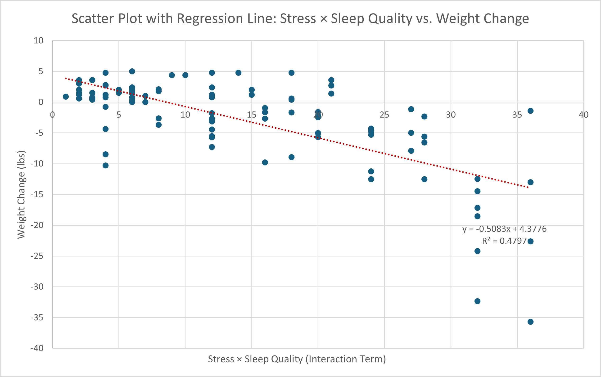

# Stress-Sleep Weight Change Analysis

**Excel analysis showing stress × poor sleep drives weight loss** (R²=0.498, β=-0.627, p=0.003) across 100 participants from Kaggle.

## 📊 Model Results at a Glance
| Predictor             | Coefficient | p-value     |
|-----------------------|-------------|-------------|
| Intercept             | 3.474       | 0.287      |
| Sleep Quality         | -0.140      | 0.899      |
| Stress Level          | 0.618       | 0.334      |
| **Stress × Sleep**    | **-0.627**  | **0.003**  |
| **R²**                | **0.498**   | 50% explained |

**F-statistic 31.80 (p<0.001)** confirms strong overall model.

## 📈 See the Pattern
  
*Clear downward trend: higher stress+poor sleep = more weight loss*

## 💡 What This Means
**Key finding**: The interaction between stress and poor sleep (not either alone) significantly predicts weight loss. 

**Practical takeaway**: Better sleep could help stabilise weight during stressful times—a simple, high-impact health strategy.

## 📁 Files Ready to Explore
- **[Dataset.xlsx](Weight_change_dataset.xlsx)** - Raw data (100 people)  
  *Source: [Kaggle Weight Change dataset](https://www.kaggle.com/datasets/abdullah0a/comprehensive-weight-change-prediction)*
- **[Analysis.xlsx](Stress-Sleep_Weight_Regression_Analysis.xlsx)** - Full model + charts
- **[Report.docx](Stress-Sleep_Weight_Change_Report.docx)** - Complete write-up

## 🎯 What I Did
1. Encoded sleep quality numerically (Excellent=1, Poor=4)
2. Created stress × sleep interaction term  
3. Built OLS regression model in Excel
4. Validated with stats + visuals

## Skills Showcased
✅ Advanced Excel analysis  
✅ Feature engineering & statistical modelling  
✅ Clear insights from data  
✅ Professional reporting  

**Try it yourself**: Download Excel files → Data tab → Data Analysis → Regression.

⭐ Star if helpful! Questions welcome.: Download Excel files → Data → Data Analysis → Regression.
